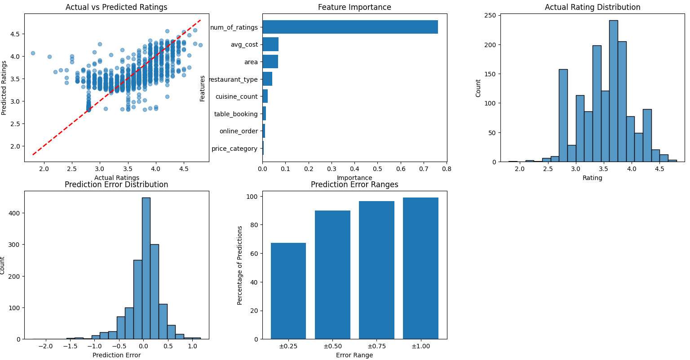

# Restaurant Rating Prediction

This project predicts restaurant ratings based on various features such as restaurant type, cuisines, location, pricing, and online booking availability. The model has been trained using machine learning techniques, and this repository provides the necessary scripts to preprocess data and make predictions.

## Table of Contents
- [Overview](#overview)
- [Installation](#installation)
- [Usage](#usage)
- [Screenshots](#screenshots)
- [Project Structure](#project-structure)
- [Contributing](#contributing)
- [License](#license)

## Overview
This project utilizes a trained machine learning model to predict restaurant ratings on a scale of 1.0 to 5.0. The model is based on historical data and takes in details about a restaurant to make predictions.

## Installation
1. Clone this repository:
   ```sh
   git clone https://github.com/lazylad99/restaurant-rating-prediction.git
   cd restaurant-rating-prediction
   ```
2. Install required dependencies:
   ```sh
   pip install -r requirements.txt
   ```
3. Ensure that the pre-trained model and preprocessor files (`preprocessor_state.joblib` and `trained_model.joblib`) are in the project directory.

## Usage
To predict the rating of a restaurant, run:
```sh
python predict.py
```
The script will take predefined restaurant details, preprocess the input, and return a predicted rating.

## Screenshots
Below is a graphical representation of the model performance:



## Project Structure
```
├── preprocessor_state.joblib  # Preprocessor state (label encoders, scalers)
├── trained_model.joblib       # Trained ML model
├── predict.py                 # Prediction script
├── requirements.txt           # Required dependencies
├── screenshots.png            # Graph outputs
├── README.md                  # Project documentation
```

## Contributing
Contributions are welcome! Feel free to submit issues or pull requests.

## License
This project is licensed under the MIT License.

